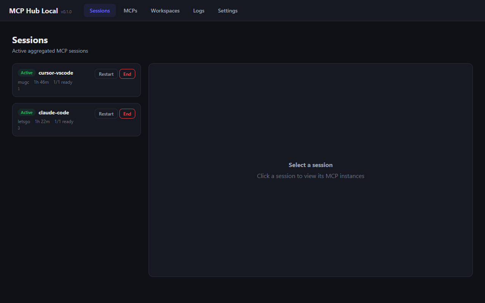
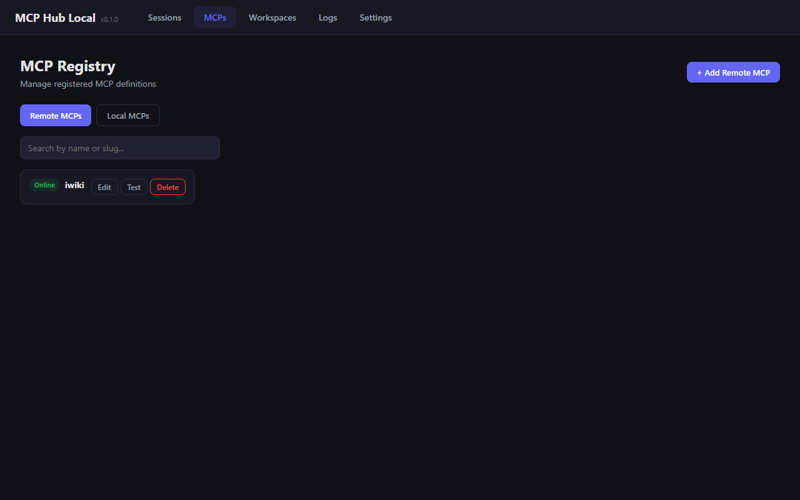
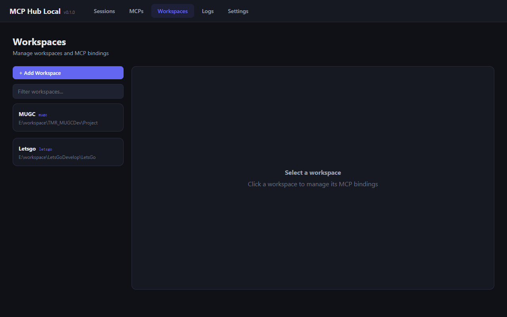
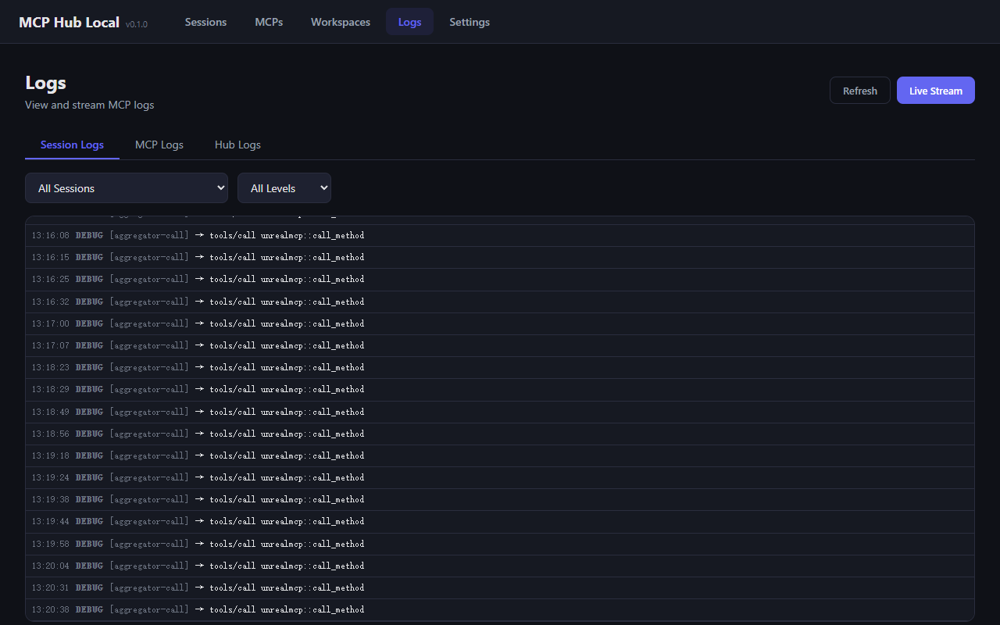
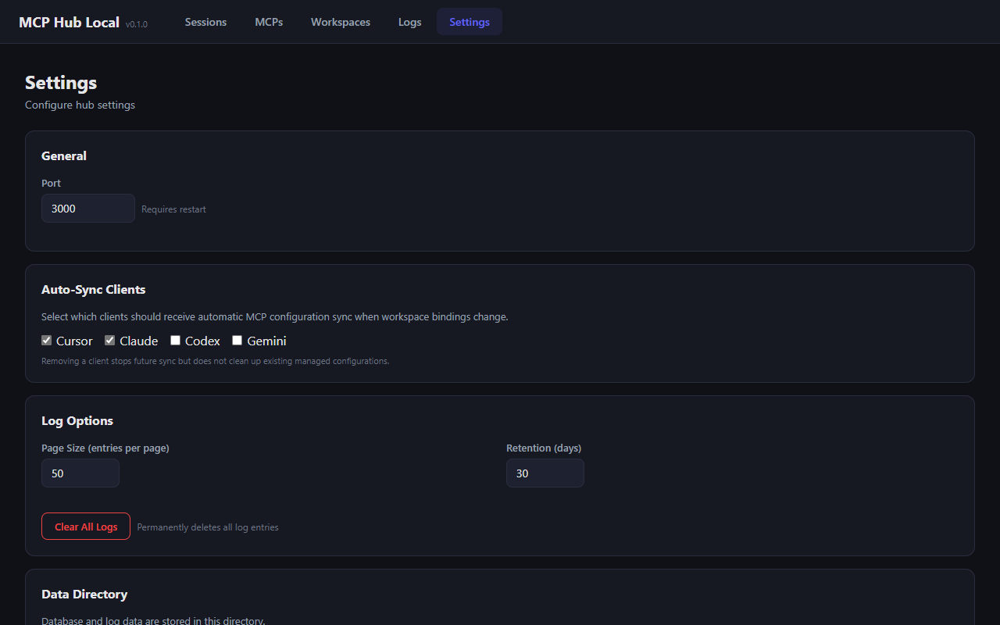
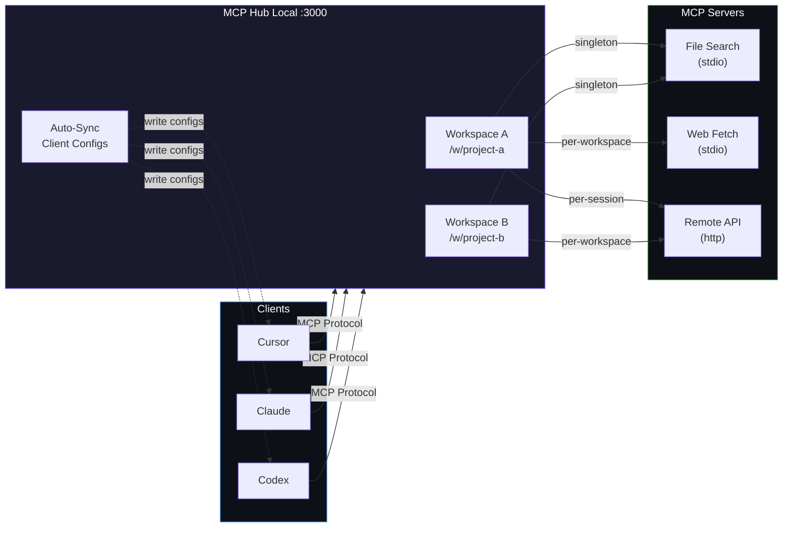

# MCP Hub Local

[](https://github.com/nustxujun/mcp-hub-local/actions/workflows/ci.yml)
[](https://www.npmjs.com/package/mcp-hub-local)
[](https://nodejs.org/)
[](./LICENSE)

**English** | [**中文**](#mcp-hub-local-1)

A single hub that takes **full control** of all MCP configurations across every workspace on your machine. Define your MCP servers once, bind them to workspaces, and let the hub automatically manage client configs, runtime lifecycles, and request routing — no more editing scattered JSON files by hand.

```
 Cursor ──┐                           ┌── File Search MCP
 Claude ──┤                           ├── Web Fetch MCP
  Codex ──┼── MCP Hub Local (/w/ws) ──┼── Database MCP
 Gemini ──┤                           ├── Git MCP
   ...  ──┘                           └── ...
```

## Screenshots

> **Dashboard** - Manage MCPs, workspaces, sessions, and logs all in one place.

**Sessions**


**MCPs**


**Workspaces**


**Logs**


**Settings**



## Features

- **Centralized MCP Control** - One place to manage all MCP servers for all workspaces; no more scattered config files across different clients and projects
- **Workspace-based Management** - Each workspace has its own set of MCPs, accessible at `/w/<slug>`; add, remove, or override MCPs per workspace from the dashboard
- **Auto-Sync Client Configs** - The hub automatically writes MCP configurations to Cursor, Claude Desktop, Codex, and Gemini — you never touch those config files again
- **Flexible Instance Modes** - Local MCPs support multiple instantiation strategies: `singleton`, `per-workspace`, `per-session`
- **PTC (Programmatic Tool Calling)** - AI clients see only `search_tools` and `execute_code` instead of dozens of individual tools, dramatically reducing tool count and context consumption
- **Session Monitoring** - Monitor MCP usage per client session in real time
- **Web Dashboard** - Manage everything from `http://localhost:3000/app`

## Quick Start

### Prerequisites

- **Node.js** >= 20

### Install & Run

```bash
# Run directly with npx (no install needed)
npx mcp-hub-local

# Or install globally
npm install -g mcp-hub-local
mcp-hub-local
```

The hub starts at **[http://localhost:3000](http://localhost:3000)** by default.


| URL                              | Description               |
| -------------------------------- | ------------------------- |
| `http://localhost:3000/app`      | Web Dashboard             |
| `http://localhost:3000/api`      | REST API                  |
| `http://localhost:3000/w/<slug>` | MCP Proxy (per workspace) |


### Development (from source)

```bash
git clone https://github.com/<your-org>/mcp-hub-local.git
cd mcp-hub-local
npm install
npm run build

# Server with hot-reload
npm run dev

# Web UI dev server (separate terminal)
npm run dev:web
```

### CLI Options

```bash
mcp-hub-local --port 5000
mcp-hub-local --config ./my-config.json
```

## How It Works



## Architecture

```
local-mcp-hub/
├── apps/
│   ├── server/          # Fastify backend + MCP aggregator
│   └── web/             # React + Vite dashboard
├── packages/
│   ├── shared/          # Types, constants, slug utils
│   ├── config-kit/      # Config format & validation
│   └── client-profiles/ # Client-specific config generators
└── data/
    └── hub.db           # SQLite database
```

### Tech Stack


| Layer    | Technology                                                                                                                      |
| -------- | ------------------------------------------------------------------------------------------------------------------------------- |
| Server   | [Fastify](https://fastify.dev/) 5, Node.js 20+                                                                                  |
| Database | SQLite 3 ([better-sqlite3](https://github.com/WiseLibs/better-sqlite3)) + [Drizzle ORM](https://orm.drizzle.team/)              |
| Frontend | [React](https://react.dev/) 19 + [Vite](https://vite.dev/) 6                                                                    |
| Protocol | [MCP Streamable HTTP](https://modelcontextprotocol.io/specification/2025-03-26/basic/transports#streamable-http) + JSON-RPC 2.0 |


### Instance Modes


| Mode            | Behavior                                          | Use Case                |
| --------------- | ------------------------------------------------- | ----------------------- |
| `singleton`     | One process shared across all workspaces          | Heavy / stateless tools |
| `per-workspace` | One process per workspace, shared across sessions | Workspace-scoped state  |
| `per-session`   | One process per client connection                 | Full isolation          |


Shared instances use **reference counting** - they stay alive while any session references them and are stopped when the last reference is released.

## PTC (Programmatic Tool Calling)

PTC consolidates all downstream MCP tools into two Hub-level tools:

| Tool | Description |
|------|-------------|
| `search_tools` | Search available tools by keyword, returns Python function signatures |
| `execute_code` | Execute a Python script that can directly call the discovered tool functions |

### Workflow

```
AI Client                         Hub                          MCP Servers
   │                               │                               │
   │── search_tools(filter) ─────>│                               │
   │<── Python function sigs ───── │                               │
   │                               │                               │
   │── execute_code(code) ───────>│── bridge call ───────────────>│
   │                               │<── return result ────────────│
   │<── result + logs ──────────── │                               │
```

### Expose & Pinned

In PTC mode, you can set **Expose** and **Pinned** options for each tool on the MCP management page:

| Option | Effect |
|--------|--------|
| **Expose** | Tool bypasses `search_tools` and is directly available to the AI client as a standalone tool. Ideal for frequently used or critical tools that AI should always be aware of |
| **Pinned** | Tool always appears in `search_tools` results regardless of keyword match. Ideal for important tools that AI should always discover, but don't need to be exposed individually |

> **Mutual exclusivity**: Expose and Pinned cannot be enabled simultaneously — once a tool is Exposed it is already directly visible, making Pinned unnecessary. Enabling Expose automatically clears Pinned.

Tools not marked as Expose or Pinned will only appear when AI searches with matching keywords via `search_tools`.

### Benefits

- **Fewer tools** — Clients only declare 2 tools + a handful of Exposed tools instead of dozens, saving tokens and context window
- **Batch execution** — A single `execute_code` call can chain multiple tool calls, reducing round trips
- **Flexible orchestration** — AI can use conditionals, loops, error handling, and other logic in Python scripts to freely compose tools
- **Fine-grained control** — Use Expose / Pinned to precisely control each tool's visibility strategy

### Configuration

Toggle **PTC (Programmatic Tool Calling)** in the Settings page. Disabled by default.

> **Note**: Existing sessions need to reconnect after toggling. Requires Python 3 installed on the system.

### Known Limitations

PTC relies on tool descriptions to instruct the AI to follow a strict workflow: **search first → then execute in one script**. In practice, AI models do not always comply — common deviations include:

- Skipping `search_tools` and calling `execute_code` directly with guessed function names
- Calling `execute_code` multiple times for a single task instead of combining everything into one script
- Not searching thoroughly enough, missing relevant tools

These are inherent limitations of prompt-based control. Different models vary in compliance, and there is currently no mechanism to enforce the workflow at the protocol level.

## API Reference

**MCPs**


| Method   | Endpoint              | Description               |
| -------- | --------------------- | ------------------------- |
| `GET`    | `/api/mcps`           | List all MCP definitions  |
| `POST`   | `/api/mcps`           | Create MCP                |
| `PATCH`  | `/api/mcps/:id`       | Update MCP                |
| `DELETE` | `/api/mcps/:id`       | Delete MCP                |
| `POST`   | `/api/mcps/:id/test`  | Test MCP connectivity     |
| `POST`   | `/api/mcps/:id/start` | Start MCP instance        |
| `GET`    | `/api/mcps/health`    | Health status of all MCPs |


**Workspaces**


| Method   | Endpoint              | Description      |
| -------- | --------------------- | ---------------- |
| `GET`    | `/api/workspaces`     | List workspaces  |
| `POST`   | `/api/workspaces`     | Create workspace |
| `GET`    | `/api/workspaces/:id` | Get workspace    |
| `PATCH`  | `/api/workspaces/:id` | Update workspace |
| `DELETE` | `/api/workspaces/:id` | Delete workspace |


**Bindings**


| Method   | Endpoint                              | Description    |
| -------- | ------------------------------------- | -------------- |
| `GET`    | `/api/workspaces/:id/bindings`        | List bindings  |
| `PUT`    | `/api/workspaces/:id/bindings`        | Set binding    |
| `DELETE` | `/api/workspaces/:id/bindings/:mcpId` | Remove binding |


**Sessions**


| Method   | Endpoint                    | Description          |
| -------- | --------------------------- | -------------------- |
| `GET`    | `/api/sessions`             | List active sessions |
| `DELETE` | `/api/sessions/:id`         | Destroy session      |
| `POST`   | `/api/sessions/:id/restart` | Restart session      |


**Logs**


| Method   | Endpoint           | Description                                                          |
| -------- | ------------------ | -------------------------------------------------------------------- |
| `GET`    | `/api/logs`        | Query logs (supports `tab`, `sessionId`, `mcpId`, `level`, `cursor`) |
| `DELETE` | `/api/logs`        | Clear all logs                                                       |
| `GET`    | `/api/logs/stream` | SSE stream (supports `tab`, `sessionId`, `mcpId`)                    |


**Settings & Config**


| Method  | Endpoint             | Description            |
| ------- | -------------------- | ---------------------- |
| `GET`   | `/api/settings`      | Get settings           |
| `PATCH` | `/api/settings`      | Update settings        |
| `GET`   | `/api/settings/info` | Server info (data dir) |
| `GET`   | `/api/config/export` | Export full config     |
| `POST`  | `/api/config/import` | Import config          |


**MCP Proxy**


| Method   | Endpoint   | Description                                      |
| -------- | ---------- | ------------------------------------------------ |
| `POST`   | `/w/:slug` | JSON-RPC requests (initialize, tools/call, etc.) |
| `GET`    | `/w/:slug` | SSE notification stream                          |
| `DELETE` | `/w/:slug` | Destroy session                                  |


## Web Dashboard

Access the dashboard at **[http://localhost:3000/app](http://localhost:3000/app)**.


| Page           | Description                                                                 |
| -------------- | --------------------------------------------------------------------------- |
| **Sessions**   | View active client connections, restart or destroy sessions                 |
| **MCPs**       | Define MCP servers, test connectivity, view runtime instances               |
| **Workspaces** | Create workspaces, manage MCP bindings, sync client configs                 |
| **Logs**       | Browse logs by category (Session / MCP / Hub), filter by level, live stream |
| **Settings**   | Configure port, log retention, auto-sync clients, clear logs, import/export |


## Configuration

### Settings


| Key                        | Default | Description                                                  |
| -------------------------- | ------- | ------------------------------------------------------------ |
| `port`                     | `3000`  | Server port (requires restart)                               |
| `enablePTC`                | `false` | Enable PTC mode (Programmatic Tool Calling)                  |
| `syncClients`              | `[]`    | Clients to auto-sync (`cursor`, `claude`, `codex`, `gemini`) |
| `logOptions.pageSize`      | `50`    | Log entries per page                                         |
| `logOptions.retentionDays` | `30`    | Log retention period                                         |


### Data Storage

All data is stored in a SQLite database at `./data/hub.db` relative to the project root. The database is created automatically on first run.

## License

[MIT](./LICENSE)

---

# MCP Hub Local

**[English](#mcp-hub-local)** | **中文**

一站式**全权管理**本地所有工作区的 MCP 配置。只需定义一次 MCP 服务器，绑定到各个工作区，Hub 会自动接管客户端配置、运行时生命周期和请求路由——从此告别手动编辑散落在各处的 JSON 配置文件。

```
 Cursor ──┐                           ┌── 文件搜索 MCP
 Claude ──┤                           ├── 网络请求 MCP
  Codex ──┼── MCP Hub Local (/w/ws) ──┼── 数据库 MCP
 Gemini ──┤                           ├── Git MCP
   ...  ──┘                           └── ...
```

## 截图

> **控制面板** - 在一个界面中管理 MCP、工作区、会话和日志。

**Sessions**


**MCPs**


**Workspaces**


**Logs**


**Settings**


## 功能特性

- **集中管控所有 MCP** - 一个地方管理所有工作区的所有 MCP 服务器，告别分散在各个客户端和项目中的配置文件
- **按 Workspace 管理** - 每个 Workspace 拥有独立的 MCP 组合和端点 `/w/<slug>`，可在控制面板中随时增删或覆盖
- **自动配置客户端** - Hub 自动将 MCP 配置写入 Cursor、Claude Desktop、Codex 和 Gemini，你再也不需要手动编辑这些配置文件
- **灵活的实例模式** - 本地 MCP 支持多种实例化模式：`singleton`（全局单例）、`per-workspace`（按工作区）、`per-session`（按会话）
- **PTC (Programmatic Tool Calling)** - AI 客户端不再直接看到数十个独立工具，而是通过 `search_tools` 搜索可用工具、再通过 `execute_code` 编写 Python 脚本批量调用，大幅减少工具数量和上下文消耗
- **会话监控** - 实时监控每个客户端会话的 MCP 使用情况
- **Web 控制面板** - 通过 `http://localhost:3000/app` 统一管理

### 前置要求

- **Node.js** >= 20

### 安装与运行

```bash
# 使用 npx 直接运行（无需安装）
npx mcp-hub-local

# 或全局安装
npm install -g mcp-hub-local
mcp-hub-local
```

默认启动地址为 **[http://localhost:3000](http://localhost:3000)**。


| 地址                               | 说明           |
| -------------------------------- | ------------ |
| `http://localhost:3000/app`      | Web 控制面板     |
| `http://localhost:3000/api`      | REST API     |
| `http://localhost:3000/w/<slug>` | MCP 代理（按工作区） |


### 开发模式（从源码）

```bash
git clone https://github.com/<your-org>/mcp-hub-local.git
cd mcp-hub-local
npm install
npm run build

# 服务端热重载
npm run dev

# Web UI 开发服务器（另开终端）
npm run dev:web
```

### 命令行参数

```bash
mcp-hub-local --port 5000
mcp-hub-local --config ./my-config.json
```

## 工作原理


## 项目结构

```
local-mcp-hub/
├── apps/
│   ├── server/          # Fastify 后端 + MCP 聚合器
│   └── web/             # React + Vite 控制面板
├── packages/
│   ├── shared/          # 共享类型、常量、slug 工具
│   ├── config-kit/      # 配置格式与校验
│   └── client-profiles/ # 客户端配置生成器
└── data/
    └── hub.db           # SQLite 数据库
```

### 技术栈


| 层级  | 技术                                                                                                                              |
| --- | ------------------------------------------------------------------------------------------------------------------------------- |
| 服务端 | [Fastify](https://fastify.dev/) 5, Node.js 20+                                                                                  |
| 数据库 | SQLite 3 ([better-sqlite3](https://github.com/WiseLibs/better-sqlite3)) + [Drizzle ORM](https://orm.drizzle.team/)              |
| 前端  | [React](https://react.dev/) 19 + [Vite](https://vite.dev/) 6                                                                    |
| 协议  | [MCP Streamable HTTP](https://modelcontextprotocol.io/specification/2025-03-26/basic/transports#streamable-http) + JSON-RPC 2.0 |


### 实例模式


| 模式              | 行为              | 适用场景     |
| --------------- | --------------- | -------- |
| `singleton`     | 全局共享一个进程        | 重型/无状态工具 |
| `per-workspace` | 每个工作区一个进程，跨会话共享 | 工作区级别状态  |
| `per-session`   | 每个客户端连接一个进程     | 完全隔离     |


共享实例使用**引用计数**——只要有会话引用就保持存活，最后一个引用释放时自动停止。

## PTC (Programmatic Tool Calling)

PTC 将 Hub 下游所有 MCP 工具收敛为两个 Hub 级别工具：

| 工具 | 说明 |
|------|------|
| `search_tools` | 按关键字搜索可用工具，返回 Python 函数签名 |
| `execute_code` | 执行 Python 脚本，脚本中可直接调用搜索到的工具函数 |

### 工作流程

```
AI 客户端                        Hub                         MCP 服务器
   │                              │                              │
   │── search_tools(filter) ────>│                              │
   │<── Python 函数签名列表 ────── │                              │
   │                              │                              │
   │── execute_code(code) ──────>│── 桥接调用 ──────────────────>│
   │                              │<── 返回结果 ─────────────────│
   │<── 执行结果 + 日志 ────────── │                              │
```

### Expose 与 Pinned

在 PTC 模式下，可以在 MCP 管理页面中为每个工具设置 **Expose** 和 **Pinned** 两个选项：

| 选项 | 作用 |
|------|------|
| **Expose** | 工具绕过 `search_tools`，作为独立工具直接暴露给 AI 客户端。适用于高频使用或需要 AI 始终感知的关键工具 |
| **Pinned** | 工具始终出现在 `search_tools` 的搜索结果中，无论关键字是否匹配。适用于希望 AI 总能发现、但不需要单独暴露的重要工具 |

> **互斥关系**：Expose 和 Pinned 不能同时勾选——工具被 Expose 后已经直接可见，不再需要 Pinned。勾选 Expose 时 Pinned 会自动取消。

未标记 Expose 也未标记 Pinned 的工具，仅在 AI 通过 `search_tools` 搜索到匹配关键字时才会出现。

### 优势

- **减少工具数量**：客户端只需声明 2 个工具 + 少量 Exposed 工具，而非数十个，节省 token 和上下文窗口
- **批量执行**：一次 `execute_code` 调用中可串联多个工具调用，减少往返轮次
- **灵活编排**：AI 可在 Python 脚本中使用条件、循环、异常处理等逻辑自由组合工具
- **精细控制**：通过 Expose / Pinned 精确控制每个工具的可见性策略

### 配置

在 Settings 页面中切换 **PTC (Programmatic Tool Calling)** 开关即可，默认关闭。

> **注意**：切换后已有会话需要重新连接才能生效。需要系统安装 Python 3。

### 已知局限

PTC 依赖工具描述中的提示词来指导 AI 严格遵循 **先搜索 → 再一次性执行** 的工作流程。但在实际使用中，AI 模型并不总是严格遵守，常见的偏离行为包括：

- 跳过 `search_tools`，直接凭猜测的函数名调用 `execute_code`
- 对同一个任务多次调用 `execute_code`，而非将所有逻辑合并到一个脚本中
- 搜索不够充分，遗漏相关工具

这是基于提示词控制的固有局限。不同模型的遵从程度各异，目前尚无协议层面的机制来强制执行该工作流。

## API 参考

**MCP 管理**


| 方法       | 端点                    | 说明          |
| -------- | --------------------- | ----------- |
| `GET`    | `/api/mcps`           | 列出所有 MCP 定义 |
| `POST`   | `/api/mcps`           | 创建 MCP      |
| `PATCH`  | `/api/mcps/:id`       | 更新 MCP      |
| `DELETE` | `/api/mcps/:id`       | 删除 MCP      |
| `POST`   | `/api/mcps/:id/test`  | 测试 MCP 连通性  |
| `POST`   | `/api/mcps/:id/start` | 启动 MCP 实例   |
| `GET`    | `/api/mcps/health`    | 所有 MCP 健康状态 |


**工作区**


| 方法       | 端点                    | 说明      |
| -------- | --------------------- | ------- |
| `GET`    | `/api/workspaces`     | 列出工作区   |
| `POST`   | `/api/workspaces`     | 创建工作区   |
| `GET`    | `/api/workspaces/:id` | 获取工作区详情 |
| `PATCH`  | `/api/workspaces/:id` | 更新工作区   |
| `DELETE` | `/api/workspaces/:id` | 删除工作区   |


**绑定**


| 方法       | 端点                                    | 说明   |
| -------- | ------------------------------------- | ---- |
| `GET`    | `/api/workspaces/:id/bindings`        | 列出绑定 |
| `PUT`    | `/api/workspaces/:id/bindings`        | 设置绑定 |
| `DELETE` | `/api/workspaces/:id/bindings/:mcpId` | 移除绑定 |


**会话**


| 方法       | 端点                          | 说明     |
| -------- | --------------------------- | ------ |
| `GET`    | `/api/sessions`             | 列出活跃会话 |
| `DELETE` | `/api/sessions/:id`         | 销毁会话   |
| `POST`   | `/api/sessions/:id/restart` | 重启会话   |


**日志**


| 方法       | 端点                 | 说明                                                  |
| -------- | ------------------ | --------------------------------------------------- |
| `GET`    | `/api/logs`        | 查询日志（支持 `tab`、`sessionId`、`mcpId`、`level`、`cursor`） |
| `DELETE` | `/api/logs`        | 清空所有日志                                              |
| `GET`    | `/api/logs/stream` | SSE 实时推送（支持 `tab`、`sessionId`、`mcpId`）              |


**设置与配置**


| 方法      | 端点                   | 说明          |
| ------- | -------------------- | ----------- |
| `GET`   | `/api/settings`      | 获取设置        |
| `PATCH` | `/api/settings`      | 更新设置        |
| `GET`   | `/api/settings/info` | 服务器信息（数据目录） |
| `GET`   | `/api/config/export` | 导出完整配置      |
| `POST`  | `/api/config/import` | 导入配置        |


**MCP 代理**


| 方法       | 端点         | 说明                                   |
| -------- | ---------- | ------------------------------------ |
| `POST`   | `/w/:slug` | JSON-RPC 请求（initialize、tools/call 等） |
| `GET`    | `/w/:slug` | SSE 通知推送流                            |
| `DELETE` | `/w/:slug` | 销毁会话                                 |


## Web 控制面板

访问 **[http://localhost:3000/app](http://localhost:3000/app)** 打开控制面板。


| 页面      | 说明                                      |
| ------- | --------------------------------------- |
| **会话**  | 查看活跃客户端连接，重启或销毁会话                       |
| **MCP** | 定义 MCP 服务器，测试连通性，查看运行实例                 |
| **工作区** | 创建工作区，管理 MCP 绑定，同步客户端配置                 |
| **日志**  | 按分类浏览日志（Session / MCP / Hub），按级别筛选，实时推送 |
| **设置**  | 配置端口、日志保留策略、自动同步客户端、清空日志、导入导出           |


## 配置项


| 配置键                        | 默认值    | 说明                                           |
| -------------------------- | ------ | -------------------------------------------- |
| `port`                     | `3000` | 服务端口（需重启）                                    |
| `enablePTC`                | `false` | 启用 PTC 模式（Programmatic Tool Calling）         |
| `syncClients`              | `[]`   | 自动同步的客户端（`cursor`、`claude`、`codex`、`gemini`） |
| `logOptions.pageSize`      | `50`   | 每页日志条数                                       |
| `logOptions.retentionDays` | `30`   | 日志保留天数                                       |


### 数据存储

所有数据存储在项目根目录下的 `./data/hub.db` SQLite 数据库中，首次运行时自动创建。

## 开源协议

[MIT](./LICENSE)